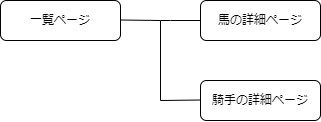

# アプリケーション名
Uma合致

# アプリケーション概要
馬の出走した情報を入力すると勝率を求めることができます。

# URL
https://umagatti.onrender.com/ 

# Basic認証
・ID : ichikawa 
・パスワード : 2616 

# 利用方法

## データ入力
1.データ入力フォームから、内容(競争日・馬名・騎手名・レース名・着順)を入力し保存できます 
2.保存したらデータが保存されたデータが表示されるので、間違ってないか確認できます 
3.サイドメニューの馬名・騎手名の欄に保存された馬名と騎手名が被らずに表示されます 

## 詳細データの確認
1.馬名をクリックすると馬が出走したレースの一覧を出して、3位までの勝利数と確率をそれぞれ表示することができます 
2.騎手名をクリックするとその騎手が出たレースの一覧を出して、3位までの勝利数と確率をそれぞれ表示することができます 

# アプリケーションを作成した背景
家族から競馬の勝率が求められるようなものが欲しいと依頼があったからです。課題としては、騎手名で検索できる機能があるといいということと、データは自分で入力したいというものがありました。データを入力する用のフォームを作成し、データベース内のデータを見れるようにすることで、間違いがないかをわかりやすくしました。もし間違いがあった場合、削除できるように削除ボタンを設けました。 
また、騎手名で検索できるようにサイドバーに項目を追加し、トグルを追加することで見た目の配慮もおこないました。騎手名をクリックした際にどのレースに出たかをわかるようにデータベースのデータを詳細側でも表示させて、勝率を求めるようにしました。 

# 洗い出した要件
https://docs.google.com/spreadsheets/d/1mFpl1dGNE48ctb-Kas-waS-m4sWmxH8r6hseakTXcAg/edit#gid=982722306 

# 実装予定の機能
1.ユーザー機能(ログイン・ログアウト)を追加する 
2.ログイン中はコメントが打てるようにする 

# テーブル設計

## race_results テーブル

| Column             | Type    | Options     |
| ------------------ | ------- | ----------- |
| race_date          | date    | null: false |
| horse_name         | string  | null: false |
| jockey_name        | string  | null: false |
| race_name          | string  | null: false |
| position           | integer | null: false |

# 画面遷移図

# 開発環境
・ソフトウェア 
・ハードウェア 
・インフラ 
・テキストエディッタ 
・テスト 
・タスク管理 

# ローカルでの動作方法
以下のコマンドを順に実行。 
% git clone https://github.com/rukorietta/umagatti 
% cd umagatti 
% bundle install 
% yarn install 

# 工夫したポイント
1.サイドメニューにトグルを追加することで、クリックするとメニューが開閉され、ユーザビリティを向上させます。 
2.リセットCSSを導入して、ブラウザのデフォルトスタイルをリセットしてます。 
3.ヘッダーとフッターの色を統一し、親和性を高めています。 
